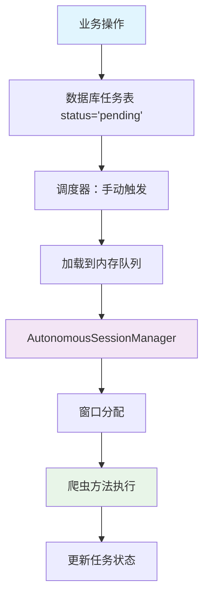

# 卖书网站价差数据分析系统 v3.0

## 系统简介

专门分析孔夫子旧书网和多抓鱼两个平台书籍价差的数据系统，通过智能爬虫发现套利机会。采用全新的**自主会话管理器架构**，实现业务层与爬虫工具的完全解耦。

## 🚀 快速开始

### 1. 安装依赖
```bash
# 使用uv（推荐）
uv sync

# 或使用pip
pip install -r requirements.txt
playwright install chromium
```

### 2. 启动Chrome（爬虫需要）
```bash
# macOS
/Applications/Google\ Chrome.app/Contents/MacOS/Google\ Chrome --remote-debugging-port=9222

# Windows  
"C:\Program Files\Google\Chrome\Application\chrome.exe" --remote-debugging-port=9222

# Linux
google-chrome --remote-debugging-port=9222
```

### 3. 启动系统
```bash
uv run python run.py
```

## 🎯 核心特性

### 📊 数据分析功能
- **ISBN实时搜索**：输入ISBN即可获取销量排行、价格分布、销售趋势
- **智能去重机制**：采用孔夫子网item_id作为主键，确保销售记录唯一性
- **品相智能筛选**：支持"九品以上"和"全部品相"两种数据源
- **动态价格分区**：自动计算5个价格区间，适用于任意价位书籍
- **成本价格对比**：集成多抓鱼收购价作为成本参考

### 🤖 智能爬虫系统
采用**自主会话管理器**架构，业务层完全无需关心爬虫工具：

- **完全自主运行**：后台自动轮询任务队列并执行
- **智能网站管理**：每个窗口内多个网站状态独立，某个网站被封不影响其他网站
- **自动状态恢复**：频率限制自动在6分钟后解封
- **零配置使用**：业务层只需添加任务，无需关心窗口池和浏览器管理

## 🏗️ 系统架构

### V3.0 核心架构理念

本系统采用**分层解耦**的设计理念，确保业务层与爬虫执行层完全分离：

#### 📋 四层架构设计

```
┌─────────────┐    1. 任务创建
│  业务层     │ ──────────► 数据库 (status='pending')
│ (Business)  │             │
└─────────────┘             │
                           │ 2. 手动调度
┌─────────────┐             │
│  调度层     │ ◄───────────┘
│ (Scheduler) │ ──────────► 内存队列 (loaded tasks)
└─────────────┘             │
                           │ 3. 自动执行
┌─────────────┐             │
│  执行层     │ ◄───────────┘
│(Execution)  │ ──────────► 窗口管理 + 任务处理
└─────────────┘             │
                           │ 4. 实际爬取
┌─────────────┐             │
│  爬虫层     │ ◄───────────┘
│ (Crawler)   │ ──────────► 网站数据获取
└─────────────┘
```

#### 🎯 分层职责

| 层级 | 组件 | 职责 | 关键原则 |
|------|------|------|----------|
| **业务层** | API Routes | 只负责创建任务到数据库 | 不涉及具体爬取执行 |
| **调度层** | Task Scheduler | 将 pending 任务加载到内存队列 | 手动触发（爬虫管理页面按钮） |
| **执行层** | AutonomousSessionManager | 从内存队列获取任务并分配窗口 | 统一窗口分发中心 |
| **爬虫层** | Crawler Methods | 接受分配的窗口执行具体爬取 | 使用 @WindowPoolManager() 装饰器 |

#### 🔄 完整任务流程



#### 🎨 核心设计原则

##### 1. **WindowPoolManager 装饰器统一窗口管理**
```python
# ✅ 正确的爬虫方法设计
class KongfuziCrawler:
    @WindowPoolManager()
    async def analyze_book_sales(self, isbn: str, days_limit: int = 30, page: Page = None):
        """分析单本书的销售记录
        
        Args:
            isbn: 书籍ISBN号
            days_limit: 天数限制
            page: 浏览器页面（由装饰器自动注入）
        """
        # 装饰器已经自动获取窗口并注入page参数
        # 爬虫方法只需专注业务逻辑
        await page.goto(f"https://www.kongfz.com/book/{isbn}")
        # ... 具体爬取逻辑
        return results

# WindowPoolManager 装饰器工作流程：
# 1. 调用 autonomous_session_manager.get_window() 获取可用窗口
# 2. 将 page 参数自动注入到爬虫方法的 kwargs 中
# 3. 执行爬虫方法，监控异常情况
# 4. 根据异常类型自动标记窗口状态：
#    - LOGIN_REQUIRED: 标记为需要登录
#    - RATE_LIMITED: 标记为频率限制（6分钟后自动恢复）
#    - 成功：标记窗口为正常状态
# 5. 自动归还窗口到 autonomous_session_manager
```

##### WindowPoolManager 装饰器详解

```python
class WindowPoolManager:
    def __init__(self, pool=None, keep_window_alive: bool = True):
        # pool 默认指向 autonomous_session_manager
        self.pool = pool or autonomous_session_manager
        self.keep_window_alive = keep_window_alive
    
    def __call__(self, func):
        async def wrapper(*args, **kwargs):
            # 自动获取窗口
            page = await self.pool.get_window()
            if not page:
                raise Exception("无法获取可用的浏览器窗口")
            
            try:
                # 注入 page 参数
                kwargs['page'] = page
                result = await func(*args, **kwargs)
                
                # 标记成功
                self.pool.mark_window_success(page)
                return result
            except Exception as e:
                # 智能错误处理
                if "LOGIN_REQUIRED:" in str(e):
                    self.pool.mark_window_login_required(page)
                elif "RATE_LIMITED:" in str(e):
                    self.pool.mark_window_rate_limited(page, duration_minutes=6)
                raise
            finally:
                # 自动归还窗口
                await self.pool.return_window(page, keep_alive=self.keep_window_alive)
        return wrapper
```

##### 2. **装饰器自动处理窗口生命周期**
- WindowPoolManager 装饰器内部使用 `autonomous_session_manager` 获取窗口
- 自动处理窗口的获取、异常处理、状态标记、归还
- 爬虫方法完全无需关心窗口管理，只需专注业务逻辑
- 智能错误处理：自动识别登录错误、频率限制等状态

##### 3. **业务层零耦合**
```python
# ✅ 业务层只关心任务创建
def create_crawl_task(isbn: str, shop_id: int):
    task = CrawlTask(
        task_type='book_sales_crawl',
        target_isbn=isbn,
        shop_id=shop_id,
        status='pending'  # 只创建，不执行
    )
    return task_repo.create(task)
```

##### 4. **调度层手动控制**

**🎯 初始化要求**：
- **窗口池必须手动初始化**：只能通过 `/window-pool-admin` 页面的"初始化窗口池"按钮
- **不会自动启动**：系统启动时不会自动创建窗口，避免资源浪费
- **默认窗口数量**：2个窗口（与原window_pool保持一致）

**📋 任务控制**：
任务执行完全可控，通过各管理页面的按钮手动触发：
- 🚀 **一键启动所有任务**：将 pending 任务加载到内存队列
- 🗑️ **一键清空任务队列**：清空内存队列（不影响数据库）
- 🔄 **所有失败任务重试**：重新加载失败任务到内存队列
- ▶️ **执行选中任务**：指定任务加载到队列

### V3.0 架构图
```
业务层 ────► 数据库任务表 (pending)
               │
               │ 手动调度触发
               ▼
           内存任务队列
               │
               │ 自动轮询
               ▼
    AutonomousSessionManager
    │
    ├─ 窗口池管理 (Chrome 9222)
    ├─ 封控状态追踪
    ├─ 智能任务分发
    └─ 统一错误处理
               │
               ▼
         爬虫方法执行
    (@WindowPoolManager 装饰器自动管理窗口)
```

**核心组件**：

1. **CrawlerServiceV2**：统一业务入口，提供简单的任务管理API
2. **TaskScheduler**：调度层，负责数据库任务到内存队列的加载
3. **AutonomousSessionManager**：执行层，统一窗口分发中心
4. **Crawler Methods**：爬虫层，使用 @WindowPoolManager() 装饰器自动获取窗口

## 📱 访问地址

- **主页**: http://127.0.0.1:8282/ - 数据展示和ISBN搜索
- **API文档**: http://127.0.0.1:8282/docs

## 💻 业务使用示例

### 添加爬虫任务（超简单）
```python
from src.services.crawler_service_v2 import crawler_service_v2

# 直接使用，无需任何初始化！
# 1. 爬取单本书销售记录
task_id = crawler_service_v2.add_book_sales_task("9787544291200")

# 2. 快速爬取ISBN相关数据
task_ids = crawler_service_v2.quick_crawl_isbn("9787544291200")

# 3. 批量添加多个ISBN
isbn_list = ["9787020002207", "9787108006240"]
batch_ids = crawler_service_v2.batch_add_isbn_tasks(isbn_list)

# 4. 添加店铺爬取任务
shop_task = crawler_service_v2.add_shop_books_task(
    shop_url="https://shop123.kongfz.com/",
    max_pages=10
)
```

### 监控任务状态
```python
# 获取完整状态
status = await crawler_service_v2.get_queue_status()

# 查看特定平台状态
kongfuzi_status = await crawler_service_v2.get_platform_status('kongfuzi')

# 健康检查
health = await crawler_service_v2.health_check()

# 统计信息
stats = await crawler_service_v2.get_statistics()
```

### 队列管理操作
```python
# 重试失败任务
retried = crawler_service_v2.retry_failed_tasks('kongfuzi')

# 清空待处理任务
cleared = crawler_service_v2.clear_pending_tasks('kongfuzi')

# 紧急停止平台
result = crawler_service_v2.emergency_stop_platform('kongfuzi')
```

## 🔧 项目结构

```
sellbook/
├── src/
│   ├── models/                      # 数据模型层
│   │   ├── database.py             # 数据库连接管理
│   │   ├── models.py               # 数据模型定义
│   │   └── repositories.py        # 数据访问层
│   ├── services/                   # 业务服务层
│   │   ├── crawler_service_v2.py   # 爬虫服务V2（统一入口）
│   │   ├── autonomous_session_manager.py  # 自主会话管理器
│   │   ├── simple_task_queue.py    # 简化任务队列
│   │   ├── analysis_service.py     # 数据分析服务
│   │   └── isbn_crawler.py         # ISBN爬虫
│   ├── routes/                     # API路由层
│   │   └── api_routes.py          # 统一API接口
│   ├── static/                     # 前端文件
│   │   └── index.html             # 主界面
│   └── main.py                     # FastAPI应用入口
├── tests/                          # 测试代码
│   ├── test_crawler_service_v2.py # V2架构测试
│   └── ...
├── data/
│   └── sellbook.db                # SQLite数据库
├── CLAUDE.md                      # 开发指南
└── README.md                      # 项目文档
```

## 🧠 智能特性

### 网站状态管理
- **AVAILABLE**: 可用状态，正常访问
- **RATE_LIMITED**: 频率限制，自动在6分钟后解封
- **LOGIN_REQUIRED**: 需要登录，需要人工处理
- **ERROR**: 一般错误状态

### 任务智能分发
- **优先级排序**：数字越大优先级越高
- **可用性检查**：只选择可用窗口的任务
- **负载均衡**：自动分配到不同窗口
- **平台隔离**：不同平台任务独立执行

### 自动错误处理
- **频率限制**：自动标记并等待解封
- **登录错误**：标记窗口需要登录，跳过使用
- **网络错误**：标记一般错误，可重试
- **超时处理**：5分钟超时自动标记失败

## 📊 数据库结构

### 主要数据表
- **shops** - 店铺信息表
- **books** - 书籍基础信息表
- **book_inventory** - 书籍库存价格表
- **sales_records** - 销售记录表（使用item_id作为主键去重）
- **crawl_tasks** - 爬虫任务表（含target_platform字段）

### 去重机制
系统采用孔夫子网的`item_id`作为主键，确保销售记录的唯一性：
```sql
CREATE TABLE sales_records (
    item_id TEXT PRIMARY KEY,  -- 孔夫子网商品ID（唯一）
    isbn TEXT,
    title TEXT,
    sale_price REAL,
    sale_time TIMESTAMP,
    quality TEXT,
    shop_id TEXT
);
```

## 🔗 API接口

### 数据分析API
- `GET /api/isbn/{isbn}/analysis` - ISBN分析（支持品相筛选）
- `GET /api/dashboard` - 获取仪表板数据
- `GET /api/sales/statistics` - 获取销售统计

### 任务管理API（V3.0新增）
爬虫任务通过代码API管理，无需HTTP接口：
```python
# 通过CrawlerServiceV2管理所有任务
crawler_service_v2.add_book_sales_task()
crawler_service_v2.get_queue_status()
crawler_service_v2.retry_failed_tasks()
```

## 🧪 测试

### 运行测试
```bash
# 测试新架构
python test_crawler_service_v2.py

# 运行完整测试套件
pytest

# 测试覆盖率
pytest --cov=src --cov-report=html
```

### 测试覆盖
- 服务初始化和健康检查
- 任务管理和批量操作
- 状态查询和监控
- 队列管理和错误处理
- 实时任务处理监控

## 🛠️ 技术栈

- **后端框架**：FastAPI 0.100+
- **数据库**：SQLite 3
- **爬虫技术**：Patchright + BeautifulSoup
- **异步处理**：asyncio/aiohttp
- **前端技术**：原生HTML/CSS/JavaScript + Chart.js
- **Python版本**：3.8+
- **测试框架**：pytest

## 🚨 重要说明

### V3.0架构优势
相比旧版本的手动任务管理，新架构具有以下优势：

| 特性 | V2.x架构 | V3.0架构 |
|------|----------|----------|
| 窗口管理 | 业务层需要关心 | 完全透明 |
| 任务调度 | 手动触发 | 自主轮询 |
| 状态管理 | 全局共享 | 网站独立 |
| 错误处理 | 复杂重试逻辑 | 智能状态分类 |
| 业务复杂度 | 高 | 低 |
| 扩展性 | 困难 | 容易 |

### 迁移指南
如果您在使用旧版本，建议迁移到V3.0架构：

1. 原有的HTTP任务管理API已废弃
2. 使用`CrawlerServiceV2`的代码API替代
3. 无需手动管理窗口池和任务队列
4. 爬虫会自动启动，无需初始化

## 📝 开发注意事项

### 🏗️ 架构原则

1. **分层职责严格分离**：
   - ❌ 业务层不能直接调用爬虫方法
   - ❌ 爬虫方法不能直接管理窗口池
   - ✅ 必须通过 session_manager 获取窗口

2. **任务流程严格遵循**：
   ```
   业务层 → 数据库(pending) → 调度触发 → 内存队列 → session_manager → 爬虫执行
   ```

3. **窗口管理统一原则**：
   - 所有窗口都由 `autonomous_session_manager` 管理
   - 爬虫方法通过 `acquire_window()` 获取，`release_window()` 归还
   - 封控状态、负载均衡都由 session_manager 处理

### 🔧 技术配置

1. **Chrome配置**：确保Chrome以调试模式运行（端口9222）
2. **数据安全**：定期备份`data/sellbook.db`数据库
3. **任务监控**：可通过`health_check()`和`get_queue_status()`监控系统状态
4. **错误恢复**：系统具有自动重试和状态恢复机制
5. **资源管理**：系统会自动管理浏览器资源，无需手动清理

### 🚨 常见反模式

```python
# ❌ 错误：业务层直接调用爬虫
async def api_crawl_book(isbn: str):
    # 违反了分层架构，业务层不应该直接执行爬取
    return await crawler.crawl_single_book_sales(isbn, shop_id)

# ✅ 正确：业务层只创建任务
def api_crawl_book(isbn: str):
    # 只创建任务，不执行，由调度层手动触发
    task = CrawlTask(task_type='book_sales_crawl', target_isbn=isbn, status='pending')
    return task_repo.create(task)

# ❌ 错误：手动管理窗口生命周期
async def crawl_method(isbn: str, session_manager=None):
    # 违反了装饰器模式，手动管理窗口复杂且易出错
    window_session = await session_manager.acquire_window('kongfz')
    try:
        page = window_session.page
        # 执行爬取逻辑
    finally:
        await session_manager.release_window(window_session)

# ✅ 正确：使用 WindowPoolManager 装饰器
@WindowPoolManager()
async def crawl_method(isbn: str, page: Page = None):
    # 装饰器自动处理窗口获取、异常处理、归还
    # 爬虫方法只需专注业务逻辑
    await page.goto(f"https://www.kongfz.com/book/{isbn}")
    # 执行具体爬取逻辑
```

## 🎉 更新日志

### v3.0 (2025-01) 🚀
- ✨ **全新四层分离架构**：业务层 → 调度层 → 执行层 → 爬虫层完全解耦
- 🎯 **核心架构理念**：
  - 业务层只负责任务创建到数据库
  - 调度层手动触发任务加载到内存队列  
  - 执行层(AutonomousSessionManager)作为统一窗口分发中心
  - 爬虫层从 session_manager 获取窗口执行具体爬取
- 🤖 **AutonomousSessionManager**：统一窗口池管理，封控状态追踪，智能任务分发
- 📋 **手动调度控制**：通过爬虫管理页面按钮完全控制任务执行时机
- 🔄 **统一窗口管理**：所有爬虫方法通过 `acquire_window()` 获取窗口，`release_window()` 归还
- 🛡️ **分层职责严格**：禁止跨层直接调用，确保架构清晰
- ⚡ **零耦合设计**：业务层与爬虫执行完全无感知
- 📊 **完整监控体系**：分层状态查询，内存队列与数据库任务统计分离

### v2.x (2024-01)
- 店铺和书籍管理模块
- ISBN实时搜索分析
- 增量爬取功能

### v1.0 (2023-12)
- 初始版本发布